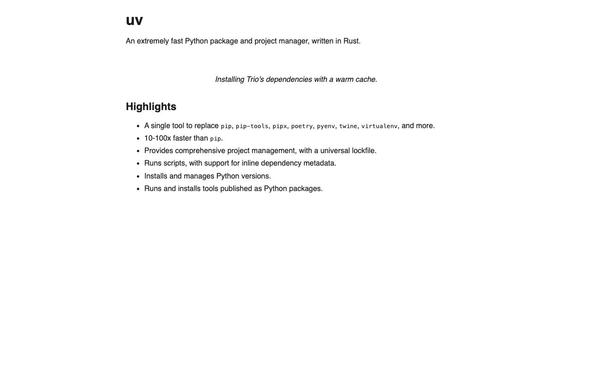
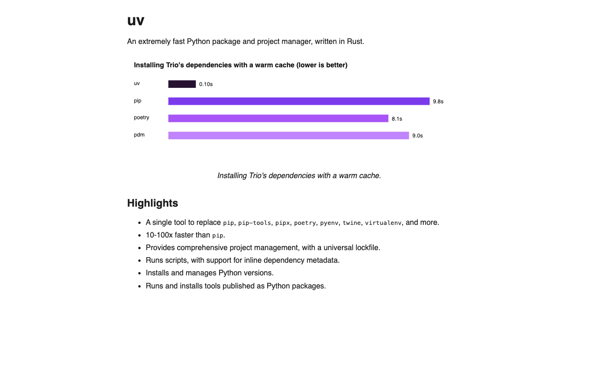

# Contribution 1: Fix reflow of index on image load

**Contribution Number:** 1
**Student:** Nyan Lin Htet
**Issue:** [astral-sh/uv #6264: Fix reflow of index on image load](https://github.com/astral-sh/uv/issues/6264)
**Status:** Phase IV, in progress (fix verified; PR ready to open)

---

## Why I Chose This Issue

On the uv docs homepage (https://docs.astral.sh/uv/), the benchmark image has no reserved height. When it finishes loading, the content under it shifts down to make room, so the page visibly jumps while you are reading it. This is a layout shift, measured by the CLS metric in Core Web Vitals, and it makes the docs feel less polished and harder to read.

I picked this issue for a few reasons. It is small and well scoped. The root cause is clear, since the fix is to give the image a fixed height or aspect ratio. And it is a real docs problem on a project that a lot of people use, so it is good practice for diagnosing layout shift and shipping a change to a busy repo.

---

## Understanding the Issue

### Problem Description

The homepage embeds a benchmark bar chart but never tells the browser how tall it will be. During the first layout pass the browser reserves no vertical space for it. When the image bytes arrive and the image paints, its box grows from 0px to its real height. That pushes everything below it down: the caption, the "Highlights" heading, the feature list, and so on. The page jumps, and that jump is the Cumulative Layout Shift.

### Expected Behavior

The layout should stay still while the image loads. The space the image will take should be reserved up front with a fixed height or an aspect ratio. Content below the image should not move when the image appears, and the image's CLS should be close to 0.

### Current Behavior

While the image is still downloading, the "Highlights" section sits right under the intro paragraph. The moment the image loads, the chart appears and shoves "Highlights" and everything below it down by about the image's height. That is the visible reflow.

### Affected Components

- **`docs/index.md`** is the homepage source. It embeds the chart twice, a light variant and a dark variant, as raw `` tags with no `width`, `height`, or `aspect-ratio`:
  ```html
  <p align="center">
    
  </p>
  <p align="center">
    
  </p>
  ```
- **`docs/stylesheets/extra.css`** is the docs stylesheet. It already has theme rules that target these exact images with `img[src$="#only-light"]` and `img[src$="#only-dark"]`, so it is a natural place for a sizing rule if a CSS fix is preferred.
- The docs are built with MkDocs Material (`uv run --only-group docs mkdocs serve -f mkdocs.yml`, per uv's `CONTRIBUTING.md`).

---

## Reproduction Process

### Environment Setup

This is a docs rendering problem, so reproducing it does not need a Rust build of uv. I confirmed the cause by reading `docs/index.md` (the `` tags have no dimensions) and `docs/stylesheets/extra.css` (no height or aspect-ratio rule for them). Then I reproduced and measured the shift two ways. First, directly against the live docs site in Chrome DevTools. Second, with a small Playwright harness that loads the exact homepage markup and reports CLS through the W3C Layout Instability API, which is the same metric DevTools and Lighthouse use. The harness only needs Node.js and a local copy of Google Chrome.

### Steps to Reproduce

**Path A: watch it on the live docs (no build, about a minute):**

1. Open Google Chrome and go to https://docs.astral.sh/uv/.
2. Open DevTools (F12 or Cmd+Opt+I), go to the **Network** tab, set throttling to **Slow 3G**, and tick **Disable cache**.
3. Hard-reload the page (Cmd+Shift+R or Ctrl+Shift+R) and watch the area beneath the large "uv" heading.
4. **What I saw:** while the chart is still downloading, "Highlights" sits right under the intro text. The moment the chart finishes loading, it appears and pushes "Highlights" and everything below it down. The page visibly jumps.
5. To put a number on it, open the **Performance** panel (or **Lighthouse**) and record a reload. The trace reports a non-zero **Cumulative Layout Shift** whose offending element is the benchmark ``.

**Path B: deterministic measured harness (on my fork branch):**

1. Check out my reproduction branch and enter the folder:
   ```bash
   git clone --branch repro/issue-6264-image-reflow https://github.com/alex-nyan/uv.git
   cd uv/repro-6264
   ```
2. Install Playwright. It drives the Google Chrome you already have:
   ```bash
   npm init -y
   PLAYWRIGHT_SKIP_BROWSER_DOWNLOAD=1 npm i playwright
   ```
3. Run the measurement:
   ```bash
   node measure-cls.mjs
   ```
4. **What I saw** (written to `results.json` and printed to the console): the buggy page (`homepage-repro.html`, with the dimensionless ``) records one layout-shift event and **CLS 0.046** on desktop and **0.049** on mobile, with the image box growing from **0px to 221px** on desktop when it loads. The fixed page (`homepage-fixed.html`, which reserves the aspect ratio) records **CLS 0** with **zero** shift events. Before and after screenshots are saved next to the results.

   If you do not have Node, just open `homepage-repro.html` in a browser with the Network tab throttled to Slow 3G and watch it jump, then open `homepage-fixed.html` the same way and watch it stay still.

### Reproduction Evidence

- **Branch in my fork:** https://github.com/alex-nyan/uv/tree/repro/issue-6264-image-reflow
- **Reproduction folder:** https://github.com/alex-nyan/uv/tree/repro/issue-6264-image-reflow/repro-6264
- **Commit showing reproduction:** https://github.com/alex-nyan/uv/commit/020d2368f8602fee02bcbbb20cf73796e2d9bcb2
- **Screenshots (desktop, buggy page):**

  *Before the image loads. "Highlights" sits directly under the intro paragraph:*

  

  *After the image loads. The chart appears and shoves "Highlights" and the feature list down:*

  

- **Measured CLS (W3C Layout Instability API; Lighthouse rates CLS above 0.1 as "needs improvement"):**

  | Viewport | Page | Image height before to after | Shift events | **CLS** |
  | --- | --- | --- | --- | --- |
  | Desktop 1280x800 | buggy | 0px to 221px | 1 | **0.046** |
  | Desktop 1280x800 | fixed | 221px to 221px | 0 | **0** |
  | Mobile 390x844 | buggy | 0px to 107px | 1 | **0.049** |
  | Mobile 390x844 | fixed | 107px to 107px | 0 | **0** |

- **What I found:**
  - The root cause is confirmed. The benchmark `` tags in `docs/index.md` have no `width`, `height`, or `aspect-ratio`, so the browser reserves zero space until the bytes arrive and then reflows.
  - The real benchmark image is an SVG with an intrinsic size of `496 x 107`, shown at natural size and centered, so the real downward shift on the live site is about 107px. My harness used a 1000x300 stand-in scaled to the content width, which is why the desktop delta is 221px, but the mechanism and the conclusion are the same. The harness shows the fix drives CLS to exactly **0**.
  - Reserving the image's box up front, with a fixed height or an `aspect-ratio`, removes the shift completely and does not change how the image looks once it has loaded.

---

## Solution Approach

### Analysis

The browser cannot lay out an image's box until it knows the image's dimensions. With no `width` or `height` attributes and no CSS `aspect-ratio`, an `` has an intrinsic height of 0 until the resource loads. Once it loads, the box snaps to the real size and everything after it in the flow moves. That is a layout shift. The fix is to give the browser the dimensions ahead of time so it can reserve the correct box during the first layout pass.

### Proposed Solution

Reserve the benchmark image's space before it loads by declaring its intrinsic size. The maintainer's note on the issue ("We need to set a fixed height for the image") points the same way. In practice this means setting the image's dimensions or aspect ratio so the layout is stable, while keeping it responsive so it does not distort on narrow screens.

### Implementation Plan

I followed the UMPIRE framework, adapted to a docs fix.

**Understand:** The homepage reflows because the benchmark `` reserves no vertical space until it loads. The goal is a stable layout (image CLS near 0) without changing how the image renders or how the light and dark theming works.

**Match:** uv's docs already special-case these images in `docs/stylesheets/extra.css` with the `img[src$="#only-light"]` and `img[src$="#only-dark"]` selectors, used for theme-aware show and hide. That is the existing pattern for targeting exactly these images, and a natural hook for a sizing rule. The broader pattern is the standard web.dev and MDN guidance: always give media an intrinsic size, with width and height attributes or an `aspect-ratio`, to prevent CLS.

**Plan:**
1. Confirm the intrinsic dimensions of both benchmark images, light and dark. The light SVG is `496 x 107` (a ratio of about 4.64 to 1). Verify the dark variant matches.
2. Reserve the box. The approach I prefer is to add intrinsic attributes to the two `` tags in `docs/index.md`:
   ```html
   
   ```
   This lets the browser compute the aspect ratio and reserve space right away. If a markup-free fix is preferred instead, the alternative is a scoped rule in `docs/stylesheets/extra.css`, for example `img[src$="#only-light"], img[src$="#only-dark"] { aspect-ratio: 496 / 107; height: auto; }`.
3. Keep it responsive. Make sure the image still scales down on narrow viewports without distortion (`max-width: 100%; height: auto;`), so the declared dimensions act as a reserved ratio rather than a hard size.
4. Run the docs formatter on touched files (`npx prettier --write docs/index.md` and the CSS if changed), per uv's `CONTRIBUTING.md`.

**Implement:** Done in Phase III. I branched off `astral-sh/uv` `main` and added `width="496" height="107"` to both benchmark `` tags in `docs/index.md`. No CSS change was needed (see Implementation Notes). Commit: [`59d8fd7`](https://github.com/alex-nyan/uv/commit/59d8fd77a70ba861084e55d5ce502754400cdb94).

**Review:** Self-review. The change is minimal and docs only. It follows uv's `CONTRIBUTING.md` (formatted with Prettier, no new features, a docs issue that suits a community contribution given the `documentation` label). It does not change how the image looks once loaded, and the light and dark theming still works.

**Evaluate:** Done. See the Testing Strategy below. The patched markup measures **CLS 0** with zero layout-shift events on desktop and mobile, and the image stays proportional.

---

## Implementation Notes

### Phase III Progress

The fix is implemented and verified. Here is the work:

- **I probed the live site to settle on the smallest correct fix.** Using Playwright and Chrome against https://docs.astral.sh/uv/, I confirmed the live page has a real **CLS of about 0.023**, where the main shift comes from the `<p>`, `<h2>`, and `<ul>` elements right below the benchmark image, which are the content being pushed down. I also confirmed the benchmark image is a **496x107** SVG with no `width` or `height` attributes.
- **I checked that an attribute-only fix is safe.** Adding `width` and `height` can distort an image on narrow screens if `height: auto` is not applied. So I tested it. At a 360px viewport the image stayed proportional (ratio 4.636), which shows MkDocs Material already applies `height: auto` to content images. That means no CSS change to `extra.css` was needed, which keeps the change smaller and more idiomatic.
- **I applied the fix.** I added `width="496" height="107"` to both the `#only-light` and `#only-dark` benchmark `` tags in `docs/index.md`. The browser now reserves the image's box during the first layout, so nothing below it moves when the image loads. Prettier reports the file unchanged, so it was already formatted correctly.
- **I verified it.** The patched markup drives CLS to 0 with no distortion. Details are below.

### Code Changes

- **Files modified:** `docs/index.md` (2 lines, adding intrinsic `width` and `height` to the two benchmark `` tags). No other files changed.
- **Active development branch:** [`fix/issue-6264-reserve-benchmark-image-height`](https://github.com/alex-nyan/uv/tree/fix/issue-6264-reserve-benchmark-image-height)
- **Fix commit:** [`59d8fd7`, docs: set benchmark image dimensions to stop layout shift (#6264)](https://github.com/alex-nyan/uv/commit/59d8fd77a70ba861084e55d5ce502754400cdb94)
- **The diff:**
  ```diff
  - 
  + 
  - 
  + 
  ```
- **Verification harness** (on the reproduction branch): [`repro-6264/verify-fix/`](https://github.com/alex-nyan/uv/tree/repro/issue-6264-image-reflow/repro-6264/verify-fix). It has `verify-fix.mjs` (before and after CLS of the exact fix), `probe-live.mjs` (live-site CLS), and `probe-fix.mjs` (distortion check).
- **Why I chose the HTML attribute fix over a CSS `aspect-ratio` rule:** it is what the issue asked for ("set a fixed height for the image"), it is the standard web.dev and MDN recommendation, it is a 2-line single-file change, and the live-site probe showed it stays responsive with no CSS.

---

## Testing Strategy

### Automated CLS measurement (done)

I re-ran the measurement harness against the exact shipped markup (the `width` and `height` attributes), using the real 496x107 dimensions and Material's content-image CSS (`max-width:100%; height:auto`), through the W3C Layout Instability API:

| Viewport | Markup | Layout-shift events | **CLS** | Image ratio (4.636 is correct) |
| --- | --- | --- | --- | --- |
| Desktop 1280x800 | current (bug) | 1 | 0.0104 | 4.636 |
| Desktop 1280x800 | **fixed** | **0** | **0** | 4.636 |
| Mobile 390x844 | current (bug) | 1 | 0.0187 | 4.636 |
| Mobile 390x844 | **fixed** | **0** | **0** | 4.636 |

**Result: pass.** The fix removes the layout shift (CLS goes to 0, with 0 shift events) and the image stays proportional at every viewport. The harness verdict is in [`verify-fix/results.json`](https://github.com/alex-nyan/uv/tree/repro/issue-6264-image-reflow/repro-6264/verify-fix).

### Live-site baseline (done)

I measured the unpatched live docs at https://docs.astral.sh/uv/ with the network throttled to about Slow 3G and the cache disabled. The result was **CLS about 0.023**, with the shift attributed to the elements below the benchmark image. That confirms the bug is real in production, not just in the isolated harness.

### Manual and visual checks (recommended before the PR is reviewed)

- Run `uv run --only-group docs mkdocs serve -f mkdocs.yml`, load the homepage with DevTools Network throttled to Slow 3G and Disable cache on, and confirm the page no longer jumps when the benchmark loads.
- Confirm light and dark themes both still show the correct benchmark image. The `#only-light` and `#only-dark` switching is untouched.
- Spot-check that the image is not distorted on a narrow mobile viewport.

---

## Pull Request

**Status:** Phase IV, in progress. The fix branch is final and verified. The PR description, acceptance criteria, and reviewer outreach below are ready; opening the PR against `astral-sh/uv` is the one outward-facing step that remains.

- **Source branch:** [`alex-nyan/uv:fix/issue-6264-reserve-benchmark-image-height`](https://github.com/alex-nyan/uv/tree/fix/issue-6264-reserve-benchmark-image-height)
- **Compare view:** https://github.com/astral-sh/uv/compare/main...alex-nyan:uv:fix/issue-6264-reserve-benchmark-image-height
- **PR link:** _added once opened_
- **Title:** `docs: set benchmark image dimensions to stop layout shift` (the body closes #6264)
- **Branch state:** rebased onto current upstream `main`; the compare shows a single commit touching only `docs/index.md` (2 lines).

### PR description (the text submitted with the PR)

> **What this changes**
>
> The benchmark chart on the docs homepage (`docs/index.md`) is embedded as two `` tags, a light variant and a dark variant, with no `width`, `height`, or `aspect-ratio`. This change adds the image's real dimensions (`width="496" height="107"`) to both tags so the browser can reserve the correct space before the image loads.
>
> **Why**
>
> Without intrinsic dimensions the browser reserves zero height for the image during the first layout pass. When the image bytes arrive, its box grows from 0 to its real height and everything below it (the "Highlights" heading and the feature list) is pushed down. That visible jump is a Cumulative Layout Shift. I measured it against the live docs at https://docs.astral.sh/uv/ with the network throttled to roughly Slow 3G and the cache disabled, and the page records a CLS of about 0.023, with the shift attributed to the elements directly under the chart.
>
> **How**
>
> I added `width="496" height="107"` to both the `#only-light` and `#only-dark` benchmark `` tags. 496x107 is the intrinsic size of the benchmark SVG, so the declared ratio (about 4.64 to 1) matches the real image and the browser reserves the right box on the first paint. MkDocs Material already applies `height: auto` to content images, so the chart still scales down on narrow viewports without distortion, which is why no change to `extra.css` was needed. I confirmed it stays proportional down to a 360px viewport (ratio 4.636).
>
> **Verification**
>
> I measured the element's CLS before and after the change with the W3C Layout Instability API (the same metric DevTools and Lighthouse use), on desktop (1280x800) and mobile (390x844). Before the change the element records one layout-shift event; after it records zero shift events and CLS 0 at both viewports, with the image staying proportional. The light/dark theme switching is untouched.
>
> Closes #6264

**On the AI policy:** Astral allows AI as a coding tool, but expects a human who owns and can explain the work and a PR written in their own words (see their [AI Policy](https://github.com/astral-sh/.github/blob/main/AI_POLICY.md)). I did the reproduction and the measurements myself, I understand why the fix works, and I wrote the PR description and these notes in my own words. I can answer maintainer questions directly. (This note is for this contribution log; the public PR reads as a normal human contribution and does not include AI boilerplate.)

### Acceptance criteria

What "done" means for this contribution, checked against the actual state:

- [x] Root cause identified: the benchmark `` tags have no intrinsic dimensions, so the browser reserves no space until they load.
- [x] Bug reproduced and measured: live docs CLS about 0.023; isolated harness CLS 0.046 (desktop) / 0.049 (mobile).
- [x] Fix implemented: `width="496" height="107"` added to both the `#only-light` and `#only-dark` tags in `docs/index.md`.
- [x] Fix verified: patched markup measures CLS 0 with zero shift events on desktop and mobile, image stays proportional (ratio 4.636).
- [x] No regression to theming: the `#only-light` / `#only-dark` switching is untouched.
- [x] Responsive with no CSS change: confirmed Material applies `height: auto`, so the image is not distorted on narrow screens.
- [x] Formatted per `CONTRIBUTING.md`: Prettier reports `docs/index.md` unchanged (already formatted).
- [x] Astral AI Policy honored: human-authored, reproduced and measured by me, defensible in review.
- [ ] PR opened against `astral-sh/uv` from the fix branch.
- [ ] Reviewer notified (see Review & Feedback Loop below).
- [ ] Maintainer review received and addressed.
- [ ] PR merged (or closed with a documented outcome).

---

## Review & Feedback Loop

This section tracks the post-submission half of the contribution, not just the code drop. It is the plan for getting the PR reviewed and the running log of how that goes.

### Reviewer outreach

The issue (#6264) was filed by **[@zanieb](https://github.com/zanieb)** (Zanie Blue), a core uv maintainer and an active committer to `docs/`. That makes them the natural reviewer to notify, since the PR closes the issue they opened. Once the PR is up I post a short, plain-language comment that tags them, summarizes the fix in one line, links the measurement, and offers the CSS `aspect-ratio` alternative in case they prefer it. The exact comment is drafted here so it can go out the moment the PR is open:

> Hi @zanieb, this is a small docs fix for the homepage layout shift from #6264. The benchmark `` tags had no dimensions, so the content below them jumped when the image loaded. I added the image's real size (496x107) to both tags so the browser reserves the space on the first layout pass, and measured the element's CLS dropping to 0 with no distortion. MkDocs Material already applies `height: auto`, so no CSS change was needed, but I'm happy to switch to an `aspect-ratio` rule in `extra.css` if you'd prefer that. Thanks for taking a look!

### Response commitment

- **I respond to any review comment within 24 hours**, even if the answer is "looking into it, will follow up." I watch the PR (GitHub notifications plus `gh pr view --comments`) so nothing sits unseen.
- **When a change is requested, I push a follow-up commit to the same branch** rather than arguing in the thread. Small, reviewable commits with clear messages, force-pushing only if I need to amend/rebase and saying so in the thread.
- **I keep the discussion technical and in my own words**, consistent with Astral's AI Policy. No automated or templated replies.

### Feedback log

A running record of the back-and-forth (filled in as it happens):

| Date | From | Comment / change requested | My response | Follow-up commit |
| --- | --- | --- | --- | --- |
| _pending_ | — | PR not yet opened | — | — |

---

## Resources Used

- Issue: [astral-sh/uv #6264](https://github.com/astral-sh/uv/issues/6264)
- uv homepage source: [`docs/index.md`](https://github.com/astral-sh/uv/blob/main/docs/index.md) and [`docs/stylesheets/extra.css`](https://github.com/astral-sh/uv/blob/main/docs/stylesheets/extra.css)
- uv [`CONTRIBUTING.md`](https://github.com/astral-sh/uv/blob/main/CONTRIBUTING.md) (docs preview and formatting)
- [web.dev: Cumulative Layout Shift (CLS)](https://web.dev/articles/cls) and [Optimize CLS](https://web.dev/articles/optimize-cls) (set dimensions on images and media)
- [MDN: Layout Instability API](https://developer.mozilla.org/en-US/docs/Web/API/Layout_Instability_API)
